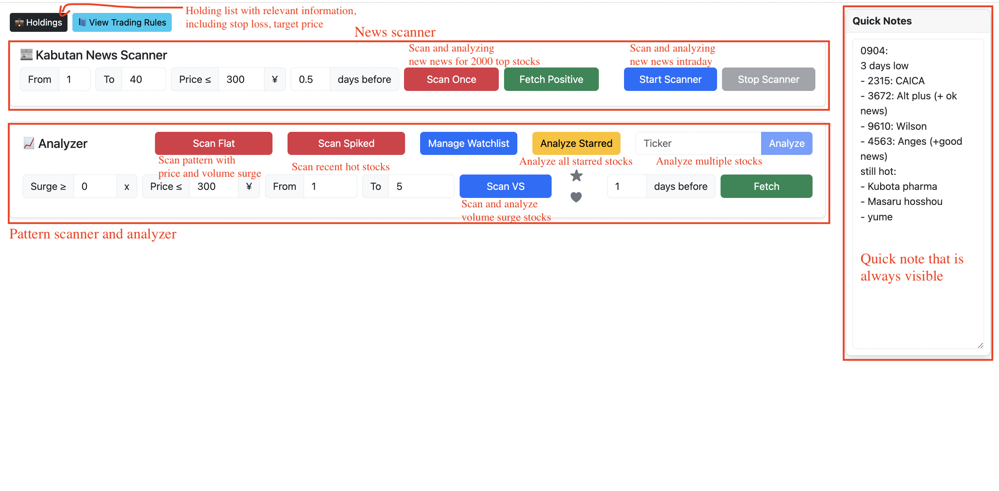
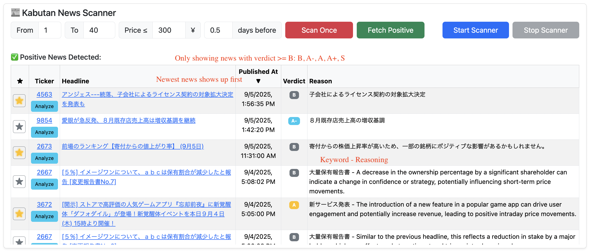
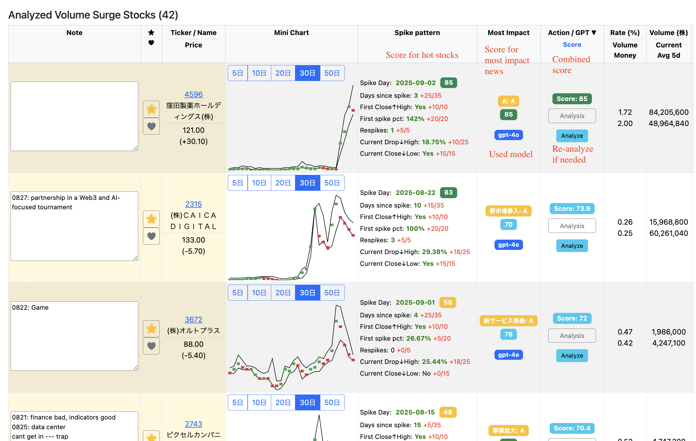
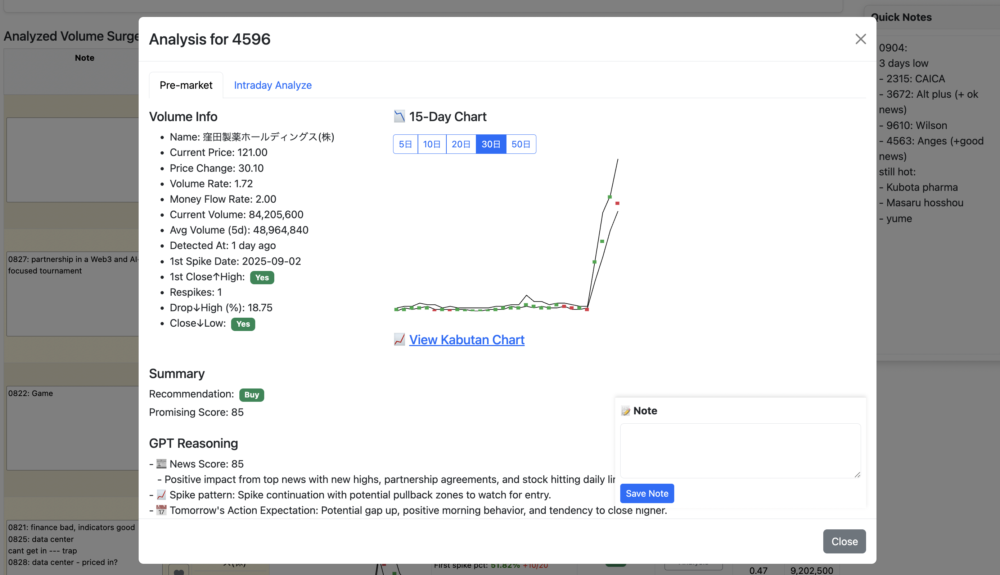
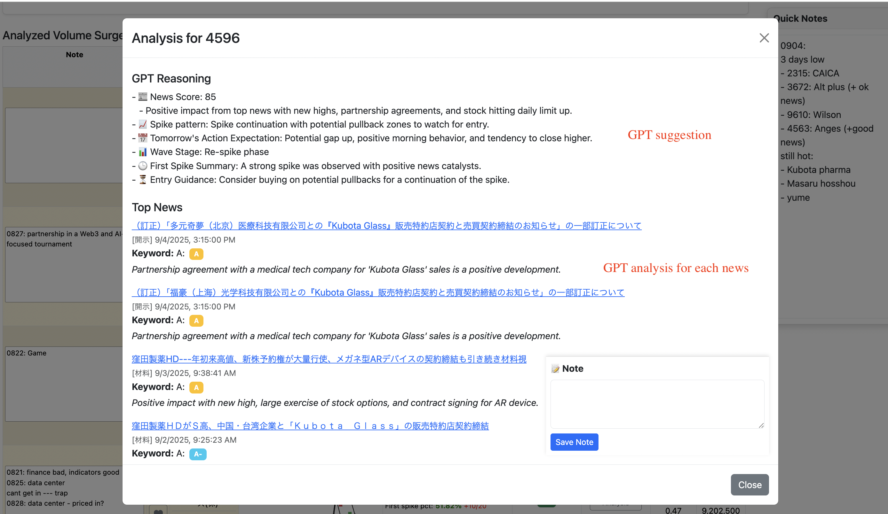

# JP Stock Analyzer

A full-stack application for analyzing Japanese stocks using fundamentals, news, and technical indicators.

The app helps traders spot volume surges, news-driven spikes, and premarket opportunities by combining real-time data with AI-powered analysis.

Built with FastAPI (backend), PostgreSQL (database), React + Vite + TypeScript + React Bootstrap (frontend), and OpenAI GPT.

---

## Features
### News scanner
- Scan top 2000 stocks
- Scrapes latest news from **Kabutan**
- Uses GPT to provide:
  - **Bullish/Bearish verdicts**
  - One-line reasoning
  - **Impact scoring** with keywords & ranking
### Hot stock scanner
- Scan top 2000 stocks
- Automatically identifies for the past 30 trading days:
  - **First spike day**
  - **Respikes**
  - **Drop from highs**
  - **Close near high/low**
- Computes **Spike Score** to evaluate trade setups
### Volume surge scanner
- Fetches real-time stock data from **Yahoo Finance Japan**
- Detects **unusual volume/money inflows**
- Highlights **promising intraday spikes**
### Stock analyzer
- GPT-powered analysis combining:
  - Technical signals
  - News sentiment
  - Volume/money flow insights

---

## 📁 Project Structure
```
jp-stock-analyzer/
├── README.md
├── backend
│   ├── Dockerfile
│   ├── app
|   │   ├── api
|   │   │   ├── longterm_apis.py
|   │   │   └── premarket_apis.py
|   │   ├── data
|   │   │   ├── historical
|   │   │   └── industry
|   │   ├── db
|   │   │   ├── db.py
|   │   │   ├── industries
|   │   │   └── init_db.py
|   │   ├── main.py
|   │   ├── models.py
|   │   ├── schemas.py
|   │   └── utils
|   │       ├── longterm
|   │       │   ├── analyze_stock_with_gpt.py
|   │       │   ├── jpx_debt_ratio.py
|   │       │   ├── jpx_perpbr_history.py
|   │       │   ├── jpx_perpbr_industry.py
|   │       │   ├── news_scraper.py
|   │       │   └── yahoo_indicators.py
|   │       └── premarket
|   │           ├── calculate_momentum_score.py
|   │           ├── downtrend_detector.py
|   │           ├── flat_analysis.py
|   │           ├── info.json
|   │           ├── intraday_analyzer.py
|   │           ├── kabutan_news_live.py
|   │           ├── notes.json
|   │           ├── pre_gpt_analyzer.py
|   │           ├── pre_scan_news.py
|   │           ├── pre_volume_surge_scraper.py
|   │           ├── scan_news_intraday.py
|   │           ├── spike_pattern.py
|   │           ├── uptrend_detector.py
|   │           ├── watchlist.csv
|   │           └── watchlist.py
│   └── requirements.txt
├── docker-compose.yml
├── frontend
│   ├── Dockerfile
│   ├── sounds
│   └── src
|       ├── App.css
|       ├── App.tsx
|       ├── api.ts
|       ├── components
|       │   ├── longterm
|       │   │   ├── HistoricalChart.tsx
|       │   │   ├── IndicatorsCard.tsx
|       │   │   ├── IndustryCard.tsx
|       │   │   ├── NewsCard.tsx
|       │   │   ├── StockSearch.tsx
|       │   │   └── SummaryCard.tsx
|       │   └── premarket
|       │       ├── AlwaysVisibleNote.tsx
|       │       ├── HighestImpactBadge.tsx
|       │       ├── IntradayAnalyzeButton.tsx
|       │       ├── IntradayAnalyzeTab.tsx
|       │       ├── MiniPriceChart.tsx
|       │       ├── PreMarketHoldingsButton.tsx
|       │       ├── PreMarketScanForm.tsx
|       │       ├── PreMarketScanNewsCard.tsx
|       │       ├── PreMarketStockModal.tsx
|       │       ├── PreMarketStockRow.tsx
|       │       ├── PreMarketStockRow_.tsx
|       │       ├── PreMarketStockTable.tsx
|       │       ├── PromisingScoreBadge.tsx
|       │       ├── Rules.tsx
|       │       ├── SpikeScoreBreakdown.tsx
|       │       ├── TopNewsVerdictBadge.tsx
|       │       ├── WatchListButton.tsx
|       │       ├── highlightUtils.tsx
|       │       └── types.ts
|       ├── index.css
|       ├── main.tsx
|       ├── pages
|       │   ├── LongTermPage.tsx
|       │   └── PreMarketPage.tsx
└── venv
```
---

## 🛠️ Tech Stack

| Layer        | Tools                                      |
|--------------|--------------------------------------------|
| Backend      | FastAPI, SQLAlchemy, PostgreSQL            |
| Data         | Yahoo Finance JP, Kabutan (scraping)       |
| LLM          | OpenAI GPT-4o                              |
| Frontend     | React, Bootstrap 5, Recharts               |
| Deployment   | Docker, Docker Compose                     |

---

## 🖥️ UI Preview
### 1. Main page overview


### 2. News analysis


### 3. Analysis


### 4. Detailed analysis for each stock



## 🚀 Getting Started

### 1. Clone the repository (not applied)

```bash
git clone https://github.com/your-username/jp-stock-analyzer.git
cd jp-stock-analyzer
```
### 2. Start all services
```
docker compose up --build
```
FastAPI backend: http://localhost:8002
React frontend: http://localhost:3000
PostgreSQL: exposed at port 5434 (locally)
### 3. Initialize the database
Once containers are running, open another terminal:
```
docker compose exec backend python -m app.db.init_db
```
This will create required tables in the PostgreSQL database.
### 4. Test the backend API
Visit or curl:
```
curl http://localhost:8002/health
```

## 🧠 Current Features Summary
- Premarket scanning of JP stocks
- Volume & money flow rate analysis (vs. 5-day avg)
- Spike pattern scoring system
- Kabutan news integration + GPT verdicts
- Mini chart visualization per stock
- Star/Watch toggles & persistent notes

### 🧑‍💻 Author
**Dinh Nguyen Duc**

Software Engineer (AI Infrastructure, MLOps, DevOps)

🇯🇵 Based in Tokyo | 🌐 English, Japanese, Vietnamese
